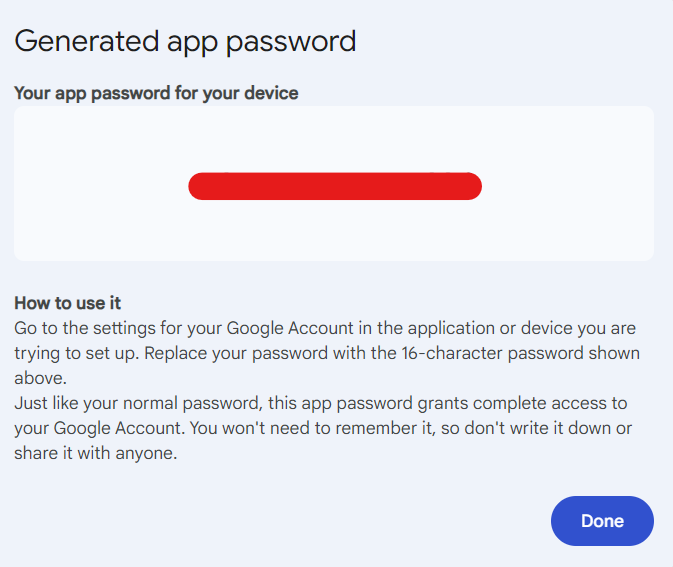

# imap-idle

This is an example repository to create IMAP idle listener in Java, Spring boot and Spring Integrations and extract the mail content.

**Steps to start server:**
1. Provide email address in `mail.imap.username` and password in `mail.imap.password`.

Notes:
1. `mail.imap.username` accepts URL encoded string. If your email is `demo.new@test.com` then URL encoded string will be `demo.new%40test.com`
2. If you want to listen to Gmail account, follow this guide to create app password: https://support.google.com/accounts/answer/185833?hl=en.

Example of Gmail App Password